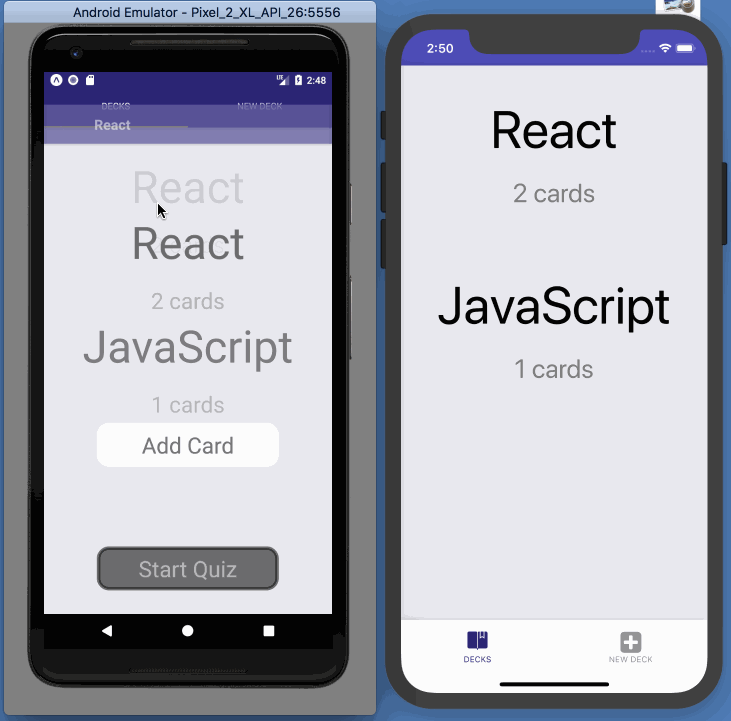

### Mobile Flash Cards

---

## Project Purpose:

Mobile Flash Cards project encompasses the fundamental aspects of building a native application including handling infinite lists, routing, and user input.

## How to Load the App
The project uses Yarn and the create-react-native-app starter.  If you do not have Yarn you can download it here: ```brew install yarn```

Once Yarn is installed, navigate to the directory where you want to store the app
```
https://github.com/kuwatly/Mobile-Flashcards-React.git
cd Mobile-Flashcards-React/
yarn install
```

And you can launch the app with
```
yarn start
```


GIF created with [LiceCap](http://www.cockos.com/licecap/).

## License
Readable is released under the [MIT License](https://opensource.org/licenses/MIT).